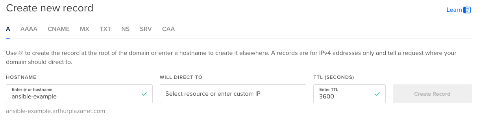
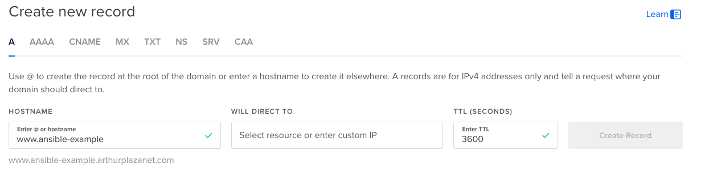

# Common Projects

## Setup Nginx Server Block

This project is meant to automate the registration of a new domain on a server, with the default configuration on Nginx and Let's Encrypt SSL certificate (TODO: can be buggy sometimes).

### Requirements

- You need to have a domain pointing to your server. For example on Digital Ocean, you register a domain and create an A record pointing to your server IP.
  
- You need to create the `www` version of your domain pointing to the same server IP.
  

### Example command

```bash
ansible-playbook -i inventories/hosts.yml -K projects/common/nginx_setup_server_block.yml
```

It will ask you the domain name, which can be given without the `www` (it will be added automatically).

```bash
BECOME password:
Which hosts would you like to use?: test
What is the domain name?: test-ansible.de
```

## Update packages and reboot if required

TODO:
